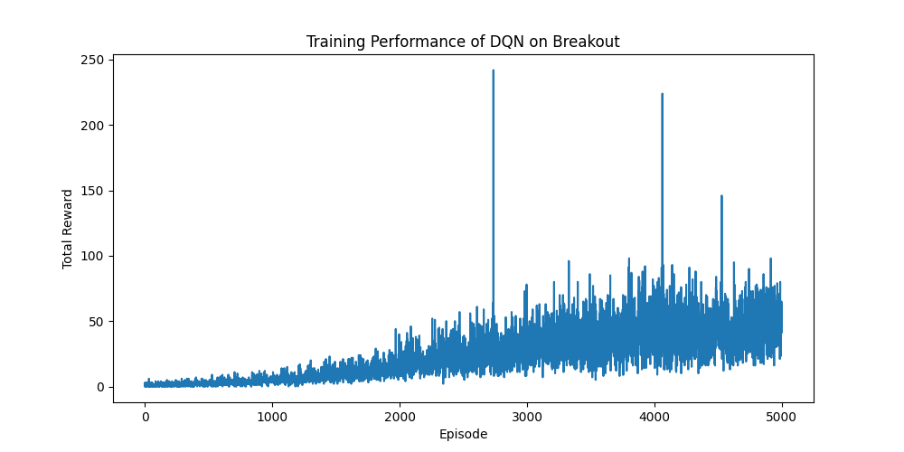

# DQN Breakout - 深度强化学习打砖块 🧱🏓

> 基于 PyTorch 实现的经典 DQN 算法，在 Atari Breakout 游戏上进行深度强化学习训练。

[](https://www.python.org/)
[](https://pytorch.org/)
[](https://gymnasium.farama.org/)
[](LICENSE)

---

## 📖 项目简介

本项目实现了 **Deep Q-Network (DQN)** 算法——深度强化学习的里程碑式工作（Mnih et al., 2015, *Nature*），并在 Atari 2600 经典游戏 **Breakout（打砖块）** 上进行训练与评估。

经过约 **350 万步 / 5000 个 episode** 的训练，智能体从完全随机的行为（平均得分 ~1 分）逐步学会了有效击打砖块，**最终平均奖励稳定在 45-50 分**。

---

## 🎮 环境说明

- **游戏**：Atari Breakout（打砖块）——控制挡板反弹小球，消除所有砖块
- **环境接口**：[Gymnasium](https://gymnasium.farama.org/) `ALE/Breakout-v5`
- **观测**：RGB 图像（210×160）→ 灰度化 → 缩放至 84×84
- **动作空间**：4 个离散动作（NOOP, FIRE, RIGHT, LEFT）

---

## 🧠 算法设计

### DQN 核心组件

| 组件 | 说明 |
|------|------|
| **经验回放 (Experience Replay)** | 容量 100,000 的缓冲区，随机采样打破样本相关性 |
| **目标网络 (Target Network)** | 与策略网络结构相同的独立网络，每 1000 步同步一次，稳定 TD 目标 |
| **帧堆叠 (Frame Stacking)** | 堆叠连续 4 帧作为输入，使网络感知运动信息 |
| **奖励裁剪 (Reward Clipping)** | 将奖励裁剪为 +1 / 0 / -1，提升训练稳定性 |
| **梯度裁剪 (Gradient Clipping)** | `clip_grad_norm_` 限制梯度范数 ≤ 10.0 |

### 网络结构

```
输入: 4 × 84 × 84 (4帧堆叠灰度图)
├── Conv2d(4, 32, kernel=8, stride=4) + ReLU
├── Conv2d(32, 64, kernel=4, stride=2) + ReLU
├── Conv2d(64, 64, kernel=3, stride=1) + ReLU
├── Flatten → 3136
├── Linear(3136, 512) + ReLU
└── Linear(512, num_actions)
```

### 超参数

| 参数 | 值 |
|------|-----|
| 学习率 | 0.0001 |
| 折扣因子 γ | 0.99 |
| 批次大小 | 32 |
| 回放缓冲区 | 100,000 |
| ε 探索率 | 1.0 → 0.02（指数衰减） |
| 目标网络更新 | 每 1000 步 |
| 优化器 | Adam |

---

## 📁 项目结构

```
.
├── train.py                  # 核心代码：环境、DQN网络、训练与评估
├── try.py                    # GPU 检测工具
├── dqn_breakout_model.pth    # 训练完成的模型权重
├── checkpoint.pth            # 训练检查点（断点续训用）
├── breakout_dqn_rewards.png  # 训练奖励曲线图
├── breakout.mp4              # 智能体游戏演示视频
├── train.txt                 # 完整训练日志（episode 0-4950）
├── breakout.docx             # Breakout 游戏资料
├── gymnasium.docx            # Gymnasium 平台资料
└── README.md                 # 本文件
```

---

## 🚀 快速开始

### 环境要求

```bash
pip install torch gymnasium[atari] numpy matplotlib opencv-python
```

### 评估已训练模型

```bash
python train.py
```

（默认调用 `evaluate()` 函数，加载 `dqn_breakout_model.pth` 并渲染游戏画面）

### 从头训练

修改 `train.py` 末尾：

```python
if __name__ == "__main__":
    train()          # 从零开始训练
    # evaluate()     # 评估已训练模型
```

### 断点续训

程序每 100 个 episode 自动保存 `checkpoint.pth`。中断后重新运行 `train()` 即可自动加载。

---

## 📈 训练结果

| Episode | 近50集平均奖励 | ε 值 |
|---------|---------------|------|
| 0 | 1.00 | 1.000 |
| 500 | 2.06 | 0.710 |
| 1000 | 4.26 | 0.505 |
| 2000 | 15.06 | 0.255 |
| 3000 | 30.88 | 0.128 |
| 4000 | 45.40 | 0.065 |
| 4900+ | 46.62 - 47.62 | 0.021 |



---

## 📚 参考资料

- Mnih, V., et al. (2015). *Human-level control through deep reinforcement learning*. Nature.
- [Gymnasium Documentation](https://gymnasium.farama.org/)
- [OpenAI Spinning Up - DQN](https://spinningup.openai.com/en/latest/algorithms/dqn.html)

---

## 📄 License

MIT License
